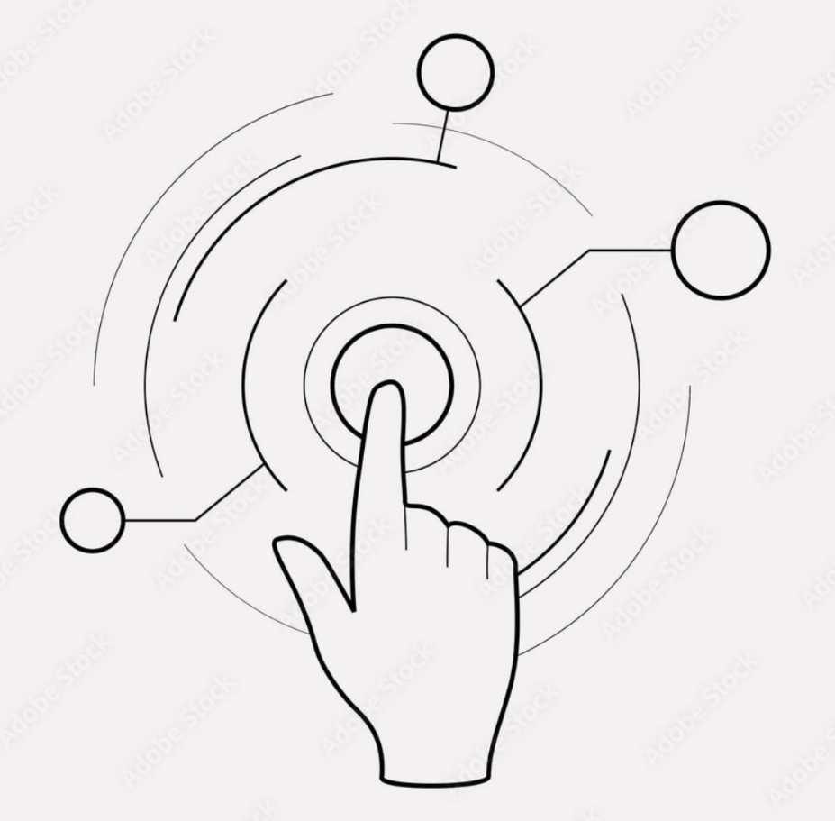

<div id="top"></div>

[](https://gitHub.com/SeifAbdElrhman/HGCv1/issues/)
[](https://gitHub.com/SeifAbdElrhman/HGCv1/pulls/)
[](https://github.com/SeifAbdElrhman/HGCv1/stargazers)
[](https://github.com/SeifAbdElrhman/HGCv1/blob/main/LICENSE)


<!-- PROJECT LOGO -->
<br />
<p align="center">
  <a href="https://github.com/\/HGCv1">
    
  </a>

  <h3 align="center">HGCv1</h3>

  <p align="center">
    A Hand Gesture Control system based on Google's Mediapipe and a custom model build on top of it for gesture classification.
    <br />
    <br />
    <a href="https://github.com/SeifAbdElrhman/HGCv1">View Demo</a>
    ·
    <a href="https://github.com/SeifAbdElrhman/HGCv1/issues">Report Bug</a>
    ·
    <a href="https://github.com/SeifAbdElrhman/HGCv1/issues">Request Feature</a>
  </p>
</p>


<!-- TABLE OF CONTENTS -->
<details open="open">
  <summary>Table of Contents</summary>
  <ol>
    <li>
      <a href="#about-the-project">About The Project</a>
      <ul>
        <li><a href="#built-with">Built With</a></li>
      </ul>
    </li>
    <li>
      <a href="#getting-started">Getting Started</a>
      <ul>
        <li><a href="#prerequisites">Prerequisites</a></li>
        <li><a href="#installation">Installation</a></li>
      </ul>
    </li>
    <li><a href="#usage">Usage</a></li>
    <li><a href="#roadmap">Roadmap</a></li>
    <li><a href="#contributing">Contributing</a></li>
    <li><a href="#license">License</a></li>
    <li><a href="#contact">Contact</a></li>
    <li><a href="#acknowledgements">Acknowledgements</a></li>
  </ol>
</details>


<!-- ABOUT THE PROJECT -->
## About The Project

<!-- [![Product Name Screen Shot][product-screenshot]](https://example.com) -->

Place Holder

### Built With

Place Holder
* [PlaceHolder](https://www.firstbenefits.org/wp-content/uploads/2017/10/placeholder.png)


<!-- GETTING STARTED -->
## Getting Started

Place Holder

### Prerequisites

Install place holder please
* PlaceHolder
  ```sh
  pip install HoldMyPlace
  ```

### Installation

1. Step 1: get a place from [PlaceHolder](https://www.firstbenefits.org/wp-content/uploads/2017/10/placeholder.png)
2. Step 2: install that Place
   ```sh
   git clone https://github.com/SeifAbdElrhman/HGCv1.git
   ```

3. Step 3: Congratulations, you've held your place.


<!-- USAGE EXAMPLES -->
## Usage


<!-- ROADMAP -->
## Roadmap


<!-- CONTRIBUTING -->
## Contributing

Contributions are what make the open source community such an amazing place to learn, inspire, and create. Any contributions you make are **greatly appreciated**.

1. Fork the Project
2. Create your Feature Branch (`git checkout -b feature/AmazingFeature`)
3. Commit your Changes (`git commit -m 'Add some AmazingFeature'`)
4. Push to the Branch (`git push origin feature/AmazingFeature`)
5. Open a Pull Request


<!-- LICENSE -->
## License

Distributed under the MIT License. See `LICENSE.txt` for more information.

<p align="right">(<a href="#top">back to top</a>)</p>


<!-- CONTACT -->
## Contact


Seif Farag - [@FaragSeif](https://t.me/FaragSeif) - s.farag@innopolis.university
<br />
Nabila Adawy - [@NabilaAdawy](https://t.me/NabilaAdawy) - n.roshdy@innopolis.university
<br />

Project Link: [https://github.com/SeifAbdElrhman/HGCv1](https://github.com/SeifAbdElrhman/HGCv1)

<p align="right">(<a href="#top">back to top</a>)</p>
