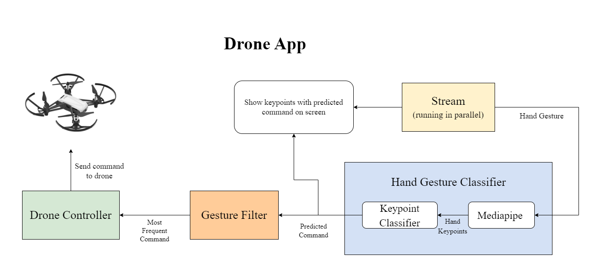

<div id="top"></div>

[](https://gitHub.com/FaragSeif/HGCv1/issues/)
[](https://gitHub.com/FaragSeif/HGCv1/pulls/)
[](https://github.com/FaragSeif/HGCv1/stargazers)
[](https://github.com/FaragSeif/HGCv1/blob/main/LICENSE)


<!-- PROJECT LOGO -->
<br />
<p align="center">
  <a href="https://github.com/\/HGCv1">
    
  </a>

  <h3 align="center">HGCv1</h3>

  <p align="center">
    A Hand Gesture Control Module based on Google's Mediapipe and a custom model build on top of it for gesture classification.
    <br />
    <br />
    <a href="#demo">View Demo</a>
    ·
    <a href="https://github.com/FaragSeif/HGCv1/issues">Report Bug</a>
    ·
    <a href="https://github.com/FaragSeif/HGCv1/issues">Request Feature</a>
  </p>
</p>


<!-- TABLE OF CONTENTS -->
<details open="open">
  <summary>Table of Contents</summary>
  <ol>
    <li>
      <a href="#about-the-project">About The Project</a>
      <ul>
        <li><a href="#demo">Demo</a></li>
        <li><a href="#built-with">Built With</a></li>
      </ul>
    </li>
    <li>
      <a href="#getting-started">Getting Started</a>
      <ul>
        <li><a href="#prerequisites">Prerequisites</a></li>
      </ul>
    </li>
    <li><a href="#roadmap">Roadmap</a></li>
    <li><a href="#contributing">Contributing</a></li>
    <li><a href="#license">License</a></li>
    <li><a href="#contact">Contact</a></li></li>
  </ol>
</details>


<!-- ABOUT THE PROJECT -->
## About The Project

<!-- [![Product Name Screen Shot][product-screenshot]](https://example.com) -->

HGC is an easy to use module for hand gesture control in any application. the module facilitates creation of a custom dataset, training a model on it, and using it to control any application. The module is based on Google's Mediapipe for hand detection and tracking, and uses a custom trained model build on top of it for gesture classification.

### Demo
Mediapipe is an amazing base for such an application since its incredably fast and optimizied for CPUs and Edge devices. The demo below shows Mediapipe in action.


<br />

This demo shows the module in action. The module is able to detect and track the hand, classify the gesture, and control the drone all in real time.


<br />

Here is a graph of how the application for drone control is constructed.



<br />

### Built With
The project uses the following frameworks and packages:
\
* Core:
  * [Mediapipe](https://google.github.io/mediapipe/)
  * [Tensorflow](https://www.tensorflow.org/)
  * [OpenCV](https://opencv.org/)

* Dataset Collection & Training:
  * [scikit-learn](https://scikit-learn.org/stable/)

* Applications:
  * [djitellopy](https://pypi.org/project/djitellopy/), For controlling the Dji Tello Drone [Github link](https://github.com/damiafuentes/DJITelloPy)
  * [pycaw](https://pypi.org/project/pycaw/), For controlling Audio for windows [Github link](https://github.com/AndreMiras/pycaw)


<!-- GETTING STARTED -->
## Getting Started

To get started you need to install the module dependencies. If you will use the pre-trained model on 8 gestures, you can skip the training part. If you want to train your own custom model, you need to collect a dataset first. The module provides a simple way to collect a dataset, and train a model on it.

### Prerequisites

* Install Requirements:
  ```sh
  pip install -r requirements.txt
  ```
Please check the comments in the requirements file and remove what you don't need before installing to avoid unnecessary installations.
<br />

### Module Usage

1. Step 1: Clone the repo using
   ```sh
   git clone https://github.com/FaragSeif/HGCv1.git
   ```
   or simply click on "Download ZIP" from the repo page.
2. Step 2: Run the dataset collection script if you want to collect your own custom gestures dataset.
   ```sh
   python create_dataset.py -n 3 -s 1000 -l label1 label2 label3 -p path/to/dataset
   ```
   where:
    * -n is the number of gestures you want to collect
    * -s is the number of samples you want to collect for each gesture
    * -l is the labels of the gestures
    * -p is the path to the dataset folder

<br />

3. Step 3: Create your application that uses and HGClassifier object and give it the path to the TFlite model you want to use (either custom or pre-trained), then specify your video stream source (0 is the defualt for most laptops). Then, use the HGClassifier object to classify the gesture and control your desired application.
   ```python
   from HGCv1.models import HGClassifier
   classifier = HGClassifier(model_path='path/to/model', src=0)
   command, image = hg_classifier.detect(draw_on_image=True)
   ```


<!-- ROADMAP -->
## Roadmap
In the future, we are planning: 
1. Add more applications examples to the module
2. Publish the module on PyPi.
3. Make it more user friendly. 
4. Add a GUI for the dataset collection and training process...?


<!-- CONTRIBUTING -->
## Contributing

Contributions are what make the open source community such an amazing place to learn, inspire, and create. Any contributions you make are **greatly appreciated**.

1. Fork the Project
2. Create your Feature Branch (`git checkout -b feature/AmazingFeature`)
3. Commit your Changes (`git commit -m 'Add some AmazingFeature'`)
4. Push to the Branch (`git push origin feature/AmazingFeature`)
5. Open a Pull Request


<!-- LICENSE -->
## License

Distributed under the MIT License. See `LICENSE.txt` for more information.

<p align="right">(<a href="#top">back to top</a>)</p>


<!-- CONTACT -->
## Contact


Seif Farag - [@FaragSeif](https://t.me/FaragSeif) - s.farag@innopolis.university
<br />
Nabila Adawy - [@NabilaAdawy](https://t.me/NabilaAdawy) - n.roshdy@innopolis.university
<br />

Project Link: [https://github.com/FaragSeif/HGCv1](https://github.com/FaragSeif/HGCv1)

<p align="right">(<a href="#top">back to top</a>)</p>
